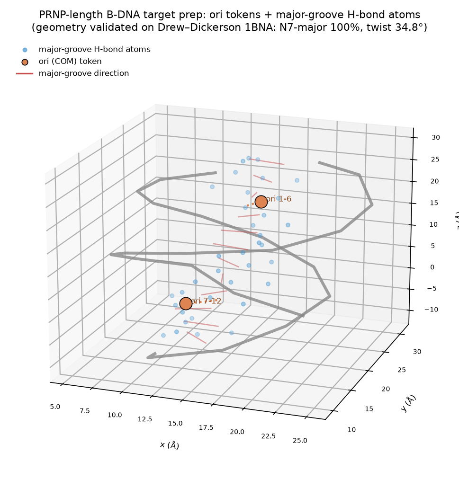

# PRNP-site target preparation

Target **T1** from Sehgal et al. 2026 — the PRNP-site, `5'-TGAGGAGAGGAG-3'` (12 bp, poly-purine).

## Contents

| File | What it is |
|---|---|
| `prnp_meta.json` | Target metadata + the paper's reference designs (DBB5 3 nM, DBB3 10 nM, DBS5) to benchmark against |
| `prnp_fold_input.json` | DNA-only duplex fold input (both strands, seed 42) — run GPU-side via pecli protenix/openfold3 to produce the B-form target |
| `prnp_conditioning.json` | **Produced after folding** by `scripts/compute_conditioning.py` — the ori tokens + major-groove H-bond atoms |
| `_demo_conditioning.json` | Demonstration of the conditioning bundle computed on the 1BNA reference (stand-in until the real fold returns) |

## How the conditioning is built

Two sequence-independent inputs, exactly as in the paper's Methods:

1. **ori (center-of-mass) tokens** — one per 6 consecutive base pairs, placed **3 Å toward the major
   groove** from the centroid of that 6-bp stretch, perpendicular to the local helical axis. For a 12-bp
   target this yields **2 ori tokens** (bp 1–6 and bp 7–12).
2. **Major-groove H-bond candidate atoms** — the canonical major-groove readout atoms per base:
   A(N7 acc, N6 don), G(N7 acc, O6 acc), C(N4 don), T(O4 acc).

## Geometry validation

The major-groove direction is derived from base-pair frames and **chemically validated**: on the
Drew–Dickerson B-DNA dodecamer (PDB 1BNA), 100% of purine N7 atoms fall on the computed major-groove
side and the mean interior helical twist is 34.8°/bp (canonical B-DNA ≈ 34°). See
`../../scripts/target_prep.py` (`validate_major_groove`).

## Workflow

```bash
# 1. Fold the duplex GPU-side (pecli): protenix/openfold3 on prnp_fold_input.json  → prnp_duplex CIF
# 2. Compute conditioning from the folded duplex (CPU, here):
python ../../scripts/compute_conditioning.py \
    --duplex ../../results/prnp_duplex/prnp_duplex_model.cif \
    --out prnp_conditioning.json --window 6 --offset 3.0
# 3. Feed the duplex + conditioning into the rfd3na binder-block spec (see specs/).
```



*Two ori tokens (orange) sit 3 Å off the helix on the major-groove side of each 6-bp stretch; blue points
are the candidate major-groove H-bond atoms; red segments show the per-base-pair major-groove direction.
Geometry shown on the 1BNA reference.*
